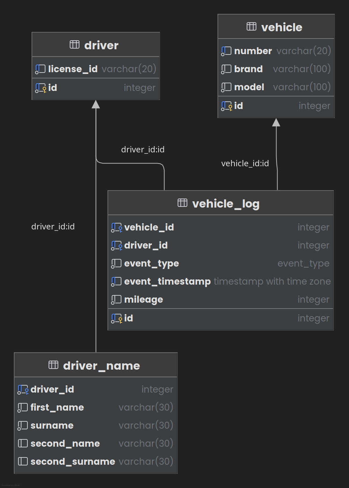

# Vehicle Registry Database

This project defines the SQL source code of the Vehicle Registry database.

## Getting Started

The [vehicle_registry.production.sql](vehicle_registry.production.sql) file
defines the PSQL for the production SQL while the
[vehicle_registry.local.sql](vehicle_registry.local.sql) defines the code for
the development database.

The common SQL for all databases is in
the [vehicle_registry.local.sql](vehicle_registry.local.sql) source file.

### Setting up the Application Database

For production, you can use a managed PSQL database (e.g. Render, AWS), or set
up your database manually.

For development machine you must install
[PostgreSQL](https://www.postgresql.org/download/) to run the application
database. Create a new user to avoid using the root user (`postgres`).

You can also install [PGAdmin](https://www.pgadmin.org/download/) or use
IntelliJ IDEA to manage the database.

Have your credentials on hand so you can set your environment variables in your
production or development environment of your Express.js application.

#### Creating the Database

Run the [vehicle_registry.production.sql](vehicle_registry.production.sql)
code into your production DBMS to create the application database. For
development, run [vehicle_registry.local.sql](vehicle_registry.local.sql)
instead.

#### Applying the Database Schema

For both production and development, run
the [vehicle_registry.sql](vehicle_registry.sql) code after
you [created the database](#creating-the-database).

The above step will finish defining the `vehicle_registry` database.

#### Populating Synthetic Data

If you want to test the application, you can apply synthetic data available at
[synthetic.sql](synthetic.sql).

#### Migrations

The project does not currently support migrations, so you are expected to set up
a greenfield database.

## Database Design

The image [vehicle_registry.png](vehicle_registry.png) contains the exported 
PSQL database diagram.

